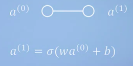
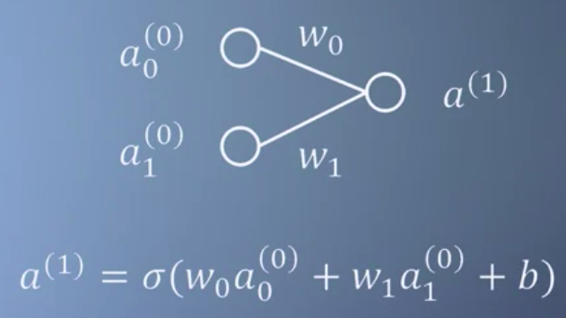
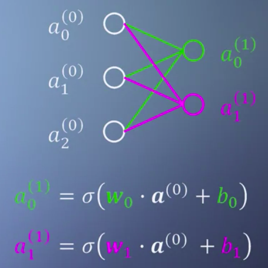
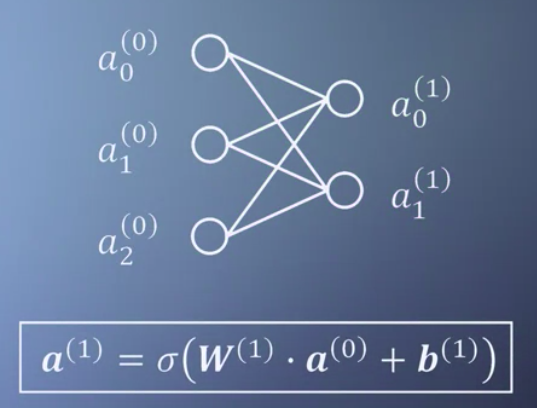
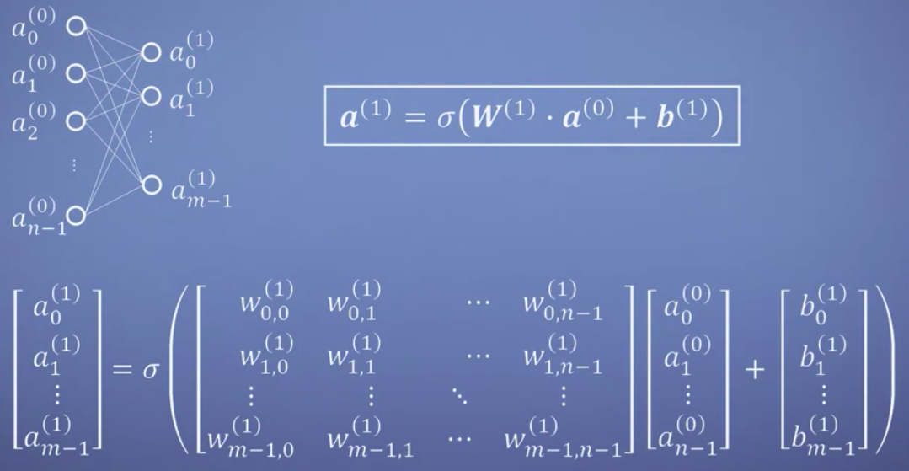
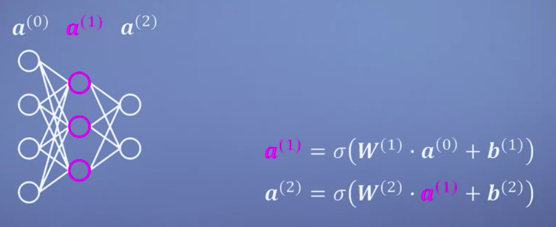
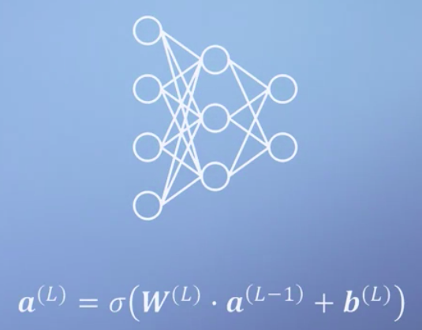

---
puppeteer:
  format: "A4"
---

# Multivariate calculus

---

> Reference: https://www.coursera.org/learn/multivariate-calculus-machine-learning

## Derivative

### Definition

$$f'(x) = \frac{df(x)}{dx} = \lim_{\Delta x\to 0} \left(\frac{f(x+\Delta x)-f(x)}{\Delta x} \right) $$

**Derivatives of some named functions**

$\frac{d}{dx} \left( \frac{1}{x} \right) = -\frac{1}{x^2}$

$\frac{d}{dx} (sin(x)) = cos(x)$

$\frac{d}{dx} (cos(x)) = -sin(x)$

$\frac{d}{dx} (e^x) = e^x$

### Derivative rules

These rules help computing the derivation faster.

* *Sum rule* $$\frac{d}{dx}(f(x) + g(x)) = f'(x) + g'(x) $$
* *Power rule* $$\frac{d}{dx}(ax^b) = abx^{b-1}$$
* *Product rule* $$ \frac{d}{dx}(f(x) g(x)) = f'(x)g(x) + f(x)g'(x)$$
* *Chain rule* $$\frac{d}{dx}g(h(x)) = g'(h(x))h'(x)$$ in other words $$\text{Given}\; g = g(u) \;\text{and}\; u = h(x)$$ $$\text{then}\; \frac{dg}{dx} = \frac{dg}{du}\frac{du}{dx}$$
* *Total derivative*: for the function $f(x,y,z, ...)$, where each variable is a function of parameter $t$, the total derivative is $$\frac{df}{dt} = \frac{\partial f}{\partial x}\frac{dx}{dt} + \frac{\partial f}{\partial y}\frac{dy}{dt} + \frac{\partial f}{\partial z}\frac{dz}{dt} + ...$$ where $$\frac{\partial f}{\partial x}$$ is the *partial derivative* of $f$ with respect to $x$

### Derivative structures

Given $f = f(x, y, z)$,

* **Jacobian** $$J_f = \left[ \frac{\partial f}{ \partial x}, \frac{\partial f}{ \partial y}, \frac{\partial f}{ \partial z} \right]$$ where $J$ is a *row vector* of the partial derivatives of $f$. This vector points in the *direction of the greatest slope* from the point $(x, y, z)$, and the *bigger the norm* of this vector, the *steeper the slope* is.
 

* **Hessian** $$ H_f =
\begin{bmatrix}
\frac{\partial^2 f}{\partial x^2} & \frac{\partial^2 f}{ \partial x \partial y} & \frac{\partial^2 f}{ \partial x \partial z} \\\\
\frac{\partial^2 f}{\partial y \partial x} & \frac{\partial^2 f}{ \partial y^2} & \frac{\partial^2 f}{ \partial y \partial z} \\\\
\frac{\partial^2 f}{ \partial z \partial x} & \frac{\partial^2 f}{ \partial z \partial y} & \frac{\partial^2 f}{\partial z^2}
\end{bmatrix}
$$ or, in a more compact notation
$$ H = \begin{bmatrix}
\partial_{xx}f & \partial_{xy}f & \partial_{xz}f \\
\partial_{yx}f & \partial_{yy}f & \partial_{yz}f \\
\partial_{zx}f & \partial_{zy}f & \partial_{zz}f \\
\end{bmatrix}
$$ When the *determinant of the the Hessian matrix* is positive, we know we are either at a minimum or a maximum (the gradient is zero). If the element $e_{11}$ of the Hessian is positive, we have a minimum; if it is negative, we have a maximum. If the determinant is negative, we have a **saddle point**.
 *Notes:* 
  * to calculate an Hessian matrix, it is easier to calculate first the Jacobian
  * the Hessian matrix is symmetrical

### Multi-variable chain rule

#### Example with $f(\pmb x(t))$
If

$$f(x_1, x_2, \ldots, x_n) = f(\pmb x) = f(\pmb x(t))$$ with $$x_1 = x_1(t), x_2 = x_2(t), \ldots, x_n = x_n(t)$$

then $$\frac{df}{dt} = \frac{\partial f}{\partial \pmb x} \cdot \frac{d \pmb x}{d t} $$

where

$$\frac{\partial f}{\partial \pmb x} = \begin{bmatrix}
\frac{\partial f}{\partial x_1} \\
\frac{\partial f}{\partial x_2} \\
\vdots \\
\frac{\partial f}{\partial x_n} \\
\end{bmatrix},
\frac{d \pmb x}{d t} = \begin{bmatrix}
\frac{dx_1}{dt} \\
\frac{dx_2}{dt} \\
\vdots \\
\frac{dx_n}{dt} \\
\end{bmatrix}$$

Note that $\frac{\partial f}{\partial \pmb x}$ is the Jacobian as a column-vector = $(J_f)^T$

#### Example with $f(\pmb x(\pmb u(t)))$

If

$$f(\pmb x(\pmb u(t)))$$

with

$$
f(\pmb x) = f(x_1, x_2), \pmb x(\pmb u) =
\begin{bmatrix}
x_1(u_1, u_2) \\
x_2(u_1, u_2)
\end{bmatrix},
\pmb u(t) =
\begin{bmatrix}
u_1(t) \\
u_2(t)
\end{bmatrix}
$$

then

$$\frac{df}{dt} = \frac{\partial f}{\partial \pmb x} \cdot \frac{\partial \pmb x}{\partial \pmb u} \cdot \frac{d \pmb u}{d t} = 
\begin{bmatrix}
\frac{\partial f}{\partial x_1} & \frac{\partial f}{\partial x_2}
\end{bmatrix}
\cdot
\begin{bmatrix}
\frac{\partial x_1}{\partial u_1} & \frac{\partial x_1}{\partial u_2} \\
\frac{\partial x_2}{\partial u_1} & \frac{\partial x_2}{\partial u_2}
\end{bmatrix}
\cdot
\begin{bmatrix}
\frac{du_1}{dt} \\
\frac{du_2}{dt}
\end{bmatrix}
$$

Note:
* $\frac{\partial f}{\partial \pmb x}$ is represented by a Jacobian row-vector 
* $\frac{d \pmb u}{d t}$ is a column vector of derivatives.
* The dot product of three matrices (1,2) by (2,2) by (2,1) is a scalar equal to $\frac{df}{dt}$.

## Neural networks

### Model of neurons

#### Definitions

where
* a = activity
* w = weight
* b = bias
* $\sigma$ = activation function

#### 2-1 neuronal network

#### 3-2 neuronal network

Using a matrix notation:

#### General case: n-m neuronal network

#### Hidden layer in a neuronal network

#### Function linking two layers in a neuronal network

#### Activation function

$$\sigma(x) = tanh(x) = \frac{e^x - e^{-x}}{e^x + e^{-x}}$$